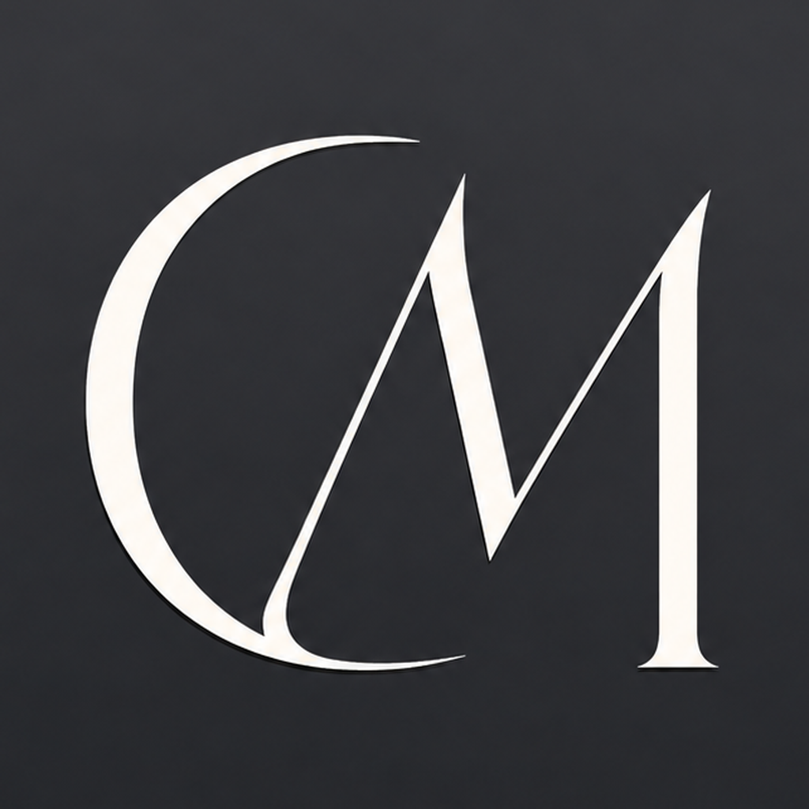

<p align="center"></p>

# Clipmacxxer

A macOS menu bar instant-replay tool. It keeps a rolling buffer of your screen
(plus system audio, optionally microphone) **entirely in RAM**, and pressing a
global hotkey (default **⇧⌘9**) captures the last N seconds as a clip. Nothing
is written to disk until you explicitly click Save on a clip.

## Download

**Quick install** — paste this in Terminal; it downloads the latest
release, installs it to Applications, and launches it:

```sh
curl -fsSL https://github.com/TrabiFR/Clipmacxxer/releases/latest/download/Clipmacxxer.zip -o /tmp/Clipmacxxer.zip \
  && ditto -x -k /tmp/Clipmacxxer.zip /Applications \
  && xattr -dr com.apple.quarantine /Applications/Clipmacxxer.app \
  && open /Applications/Clipmacxxer.app
```

(The `xattr` step clears macOS's download quarantine — needed because
this build isn't notarized. The full source is right here if you want to
check what you're running, and building it yourself is two commands.)

**Manual install** — grab `Clipmacxxer.zip` from the latest
[GitHub release](../../releases/latest), unzip, and drag the app to
Applications. The first launch needs one extra step: macOS will say it
"could not verify" the app — open **System Settings → Privacy &
Security**, scroll down, and click **Open Anyway**. After that it
launches normally.

## Build & run

Requires macOS 14+ and the Xcode toolchain (Xcode 15 or newer).

```sh
./build_app.sh
open build/Clipmacxxer.app
```

First launch: macOS will ask for **Screen Recording** permission
(System Settings → Privacy & Security → Screen & System Audio Recording).
Grant it, then click **Start** in the menu bar popover (or relaunch).
If you enable the Microphone toggle in Settings, a mic permission prompt
follows.

`swift run` also works for quick iteration, but permissions attach to the
terminal instead of the app, so prefer the bundle.

### Permissions after rebuilds

Without a signing certificate the app is ad-hoc signed, and macOS ties the
Screen Recording grant to the exact binary — after a rebuild the old grant
goes stale and capture fails silently. `build_app.sh` now detects this and
resets the permission so macOS simply re-prompts on the next launch. To make
the grant survive rebuilds entirely, add a free Apple Development
certificate (Xcode → Settings → Accounts → add any Apple ID → Manage
Certificates → + → Apple Development); the script picks it up automatically.

### App icon

The CM logo (`assets/logo.png`) ships as the app icon by default —
`build_app.sh` converts it to `AppIcon.icns` automatically. To use a
different icon, replace that file with your own 1024×1024 PNG and rebuild.

## Usage

- The menu bar icon (⏺) opens the popover. The header keeps the scissor,
  **Save All**, settings (gear), and Start/Stop buttons available at all
  times — including while recording — and capturing a clip switches back to
  the clip list so you can see what you've clipped so far.
- Press the hotkey any time to capture the last N seconds (default 30 s,
  configurable 5–120 s). A "Pop" sound confirms capture. Clipping does **not**
  consume the buffer — press it twice for two overlapping clips.
- Clips stay **in RAM** until you save them: **Save** on a clip row writes
  that clip to the save folder, **Save All** in the header writes every
  unsaved clip at once. "Auto-save clips when captured" in Settings (off by
  default) saves each clip to the folder the moment it's captured.
- Each clip row: **Play** (decodes straight from RAM into a player window),
  **Save** / **Show in Finder** (once saved), **Discard**.
- Settings: clip length, hotkey, save folder, auto-save, quality
  (720p / 1080p / native), frame rate (30/60), system audio, microphone
  (macOS 15+), memory cap (512 MB / 1 GB / 2 GB), save format (MOV/MP4),
  start-at-launch.

## How it stays in RAM (and under the cap)

- Screen frames are hardware-encoded to H.264 (VideoToolbox) **as they
  arrive**; only compressed samples sit in the ring buffer. At the default
  1080p/5 Mbps/30 fps, a 35 s window is roughly 25 MB; each 30 s clip is
  about 20 MB, so a 1 GB cap fits the buffer plus ~45 clips.
- Audio is buffered as raw PCM (~380 KB/s) and encoded to AAC only on save.
- Saving uses `AVAssetWriter` in passthrough mode for video — no re-encode,
  no temp files, written directly to the file you pick.
- Playback feeds the in-RAM samples to `AVSampleBufferDisplayLayer` /
  `AVSampleBufferAudioRenderer` — no temp file for preview either.
- The memory gauge tracks buffer + clip bytes. When a new clip would exceed
  the cap, the oldest clips are dropped (you're told in the popover); if the
  gauge passes 85% it turns orange.

## Design decisions (the spec's open questions)

- **Cap scope**: the cap covers rolling buffer + clip library combined
  (footage bytes; the app binary/UI overhead is small and outside it).
- **Multiple clips**: yes — clip extraction is a non-destructive copy of the
  window, so rapid repeated hotkey presses produce overlapping clips.
- **Save format/location**: MOV (H.264 + AAC) by default, MP4 selectable;
  save panel defaults to ~/Movies.
- **Buffer vs. clip length**: the buffer holds clip length + 5 s so a clip can
  always start on a keyframe at or before the requested window.
- **Minimum macOS**: 14 (Sonoma). Microphone capture uses ScreenCaptureKit's
  mic support and needs macOS 15.

## Caveats

- macOS virtual memory can still swap any process's pages to disk under
  pressure; "never touches disk" is guaranteed at the app level, not the OS
  level. Locking pages with `mlock` was left out of scope — at a 1 GB
  budget, wiring would be the bigger concern and macOS handles this fine in
  practice.
- ScreenCaptureKit only delivers frames when the screen changes; a 1 fps
  heartbeat re-encodes the last frame during static periods so the buffer
  timeline never has gaps.
- Captures the main display; Clipmacxxer's own windows are excluded from
  the recording.

## License

[GPLv3](LICENSE) — use it, fork it, learn from it, but derivative works
must stay open source.
